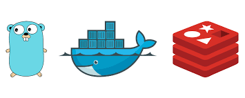

# napptive-hackathon

---
wemakedevs napptive hackathon on OAM

trying to acchieve 3 outcomes to create the redis OAM with custom made configmap and app to show the details

## Components
- Redis database
- Gin Go server

## Tasks
- [x] Redis cluster using OAM
- [x] Custom ConfigMap
- [x] Done with data to be shown when started
- [x] go server
- [ ] _(optional)_ write blog
